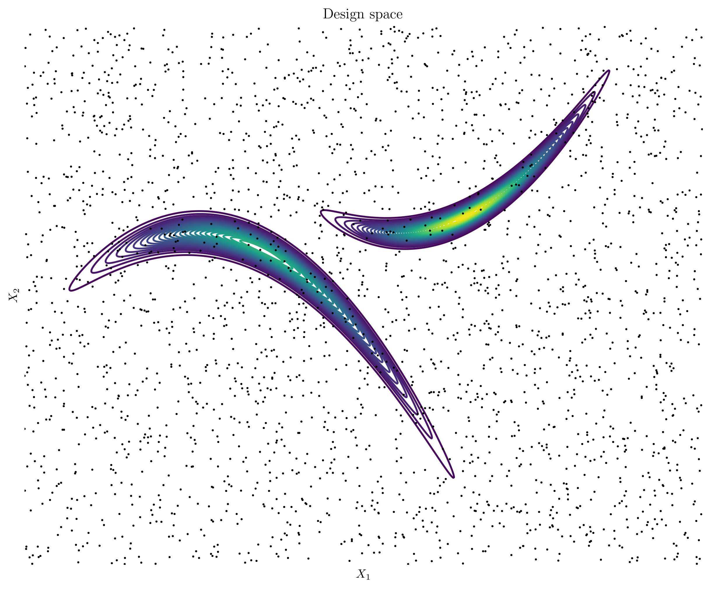
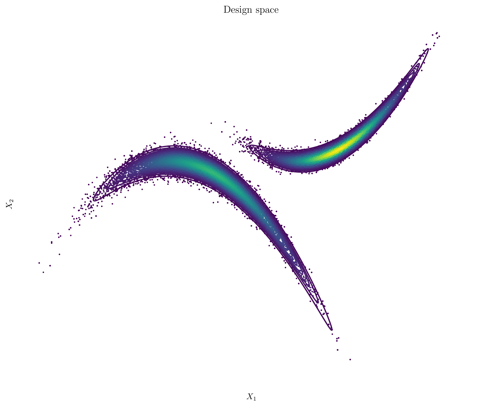

# Design space exploration

A visual guide to design space exploration and optimisation

## Motivation

Efforts at the intersection of machine learning and simulation generally fall into two main categories: (1) accelerating simulations and (2) enhancing design space exploration and optimisation. These categories are interconnected, forming a feedback loop where advances in one area can significantly impact the other. Accelerating simulations can unlock *outer-loop* applications that are currently infeasible due to the high computational cost associated with numerous repeated simulations. Conversely, improving design space exploration can drastically reduce the number of simulations needed to identify optimal designs or strategically navigate the design space to minimise uncertainty.

## 1. Design space

Contour plot illustrating the relationship between two design parameters, $X_1$ and $X_2$, and the corresponding values of the objective function.

## 2. Grid search

Each point represents a single run of a computationally expensive simulation

## 3. Monte Carlo

## 4. Markov Chain Monte Carlo

